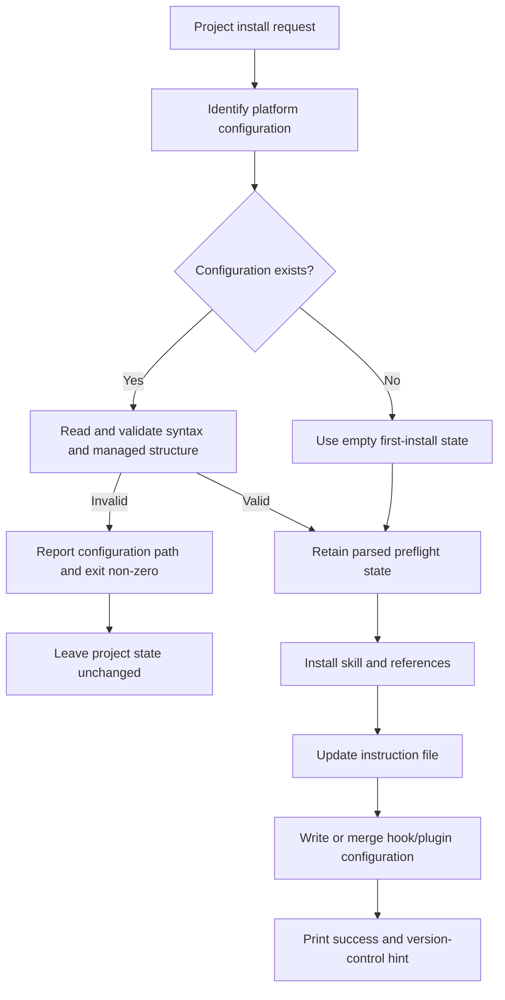

## Goal Capsule

- **Objective:** Prevent project-scoped Graphify installs from leaving skill files, instruction files, plugins, or version stamps behind when an existing platform configuration cannot be validated.
- **Authority:** The confirmed behavior in GitHub issue #2416 is authoritative for the Codex case. Existing configuration-preservation and backup behavior remains authoritative unless this plan states otherwise.
- **Execution profile:** Deep, cross-platform installer hardening with test-first failure-path coverage.
- **Stop conditions:** Do not broaden the change into a general transaction framework, a redesign of uninstall semantics, or unrelated installer cleanup.
- **Completion signal:** Every supported project installer that parses existing configuration validates it before its first Graphify-owned mutation, and the failure-path tests prove the original project state is unchanged for validation failures.

---

## Product Contract

### Summary

Issue #2416 reports that a project-scoped Codex install exits with failure after writing the Graphify skill and `AGENTS.md` when an existing `.codex/hooks.json` is invalid. The install command must fail closed: it must preserve user-owned configuration and avoid creating or changing Graphify-owned project artifacts when preflight validation fails.

The maximum-benefit scope applies the same safety contract to project installers that have the same write-before-configuration-validation pattern, while preserving each platform's existing configuration format and merge behavior.

### Problem Frame

The installer performs several independent writes across skill trees, instruction files, plugins, and platform configuration. Existing per-file atomicity protects individual skill/reference writes, but it does not protect the complete project install. Configuration validation currently occurs after earlier writes for Codex and analogous platforms. A failed command therefore leaves a state that looks partially installed even though the command reports failure.

The repository already has strict JSON validation for Claude, CodeBuddy, Codex, and Gemini hook helpers, plus BOM tolerance and rolling backups. The missing contract is validation at the orchestration boundary before any sibling artifact is changed.

### Requirements

- R1. A project install must preflight every existing platform configuration file that it will parse or modify before creating or changing any Graphify-owned project artifact.
- R2. A missing configuration file remains a valid first-install state and must continue through normal installation.
- R3. Invalid JSON, invalid JSONC, a non-object top level, or an invalid managed collection must produce a non-zero failure without overwriting the original configuration.
- R4. When preflight validation fails, the project state must not gain or change Graphify skill files, references, version stamps, instruction sections, plugins, generated configuration, or backups from that install attempt.
- R5. A valid existing configuration must preserve unrelated user settings and existing user hooks or plugins while retaining current Graphify merge, backup, BOM, JSONC, and idempotency semantics.
- R6. Failure output must identify the configuration that blocked installation and tell the user to repair or move it before retrying.
- R7. The same safety contract must cover the supported project-install paths for Codex, Claude, Gemini, OpenCode, and Kilo. The CodeBuddy helper must not regress when called with an explicit project directory, but adding a new CodeBuddy project CLI surface is outside this plan.
- R8. Existing global-install behavior and project/global scope isolation must remain unchanged except where the shared validation contract prevents unsafe mutation of an invalid existing configuration.

### Acceptance Examples

- AE1. **Codex invalid configuration:** Given an existing invalid `.codex/hooks.json`, when a project Codex install runs, then it exits non-zero, leaves that file byte-identical, creates no Graphify skill tree or backup, and leaves `AGENTS.md` byte-identical or absent as it was before the command.
- AE2. **Codex first install:** Given no `.codex/hooks.json`, when a project Codex install runs, then it creates the skill tree, Graphify `AGENTS.md` section, and valid hook configuration.
- AE3. **Codex malformed structure:** Given valid JSON whose top level is not an object, whose `hooks` value is not an object, or whose `PreToolUse` value is not a list, when installation runs, then it fails before any project mutation and preserves the original bytes.
- AE4. **Valid merge:** Given a valid platform configuration containing unrelated settings and user-owned managed-section entries, when installation runs, then those values survive and exactly one current Graphify entry is installed.
- AE5. **OpenCode and Kilo invalid configuration:** Given malformed existing OpenCode JSON or Kilo JSON/JSONC, when the corresponding project install runs, then it refuses the install instead of replacing the configuration with an empty object or writing a plugin first.
- AE6. **JSONC preservation:** Given a valid Kilo JSONC configuration, when installation runs, then the source JSONC remains unchanged and the existing sibling-output behavior remains valid while the plugin registration is added safely.
- AE7. **Reinstall:** Given a successful install followed by a second install, then the Graphify section/plugin/hook is not duplicated and an unchanged configuration does not create backup churn.
- AE8. **Scope isolation:** Given a global Graphify skill and a project install attempt, when project preflight fails, then the global skill and all unrelated project files remain unchanged.

### Success Criteria

- A disposable repository reproduces the issue before the change and remains byte-identical after the invalid-configuration failure following the change.
- Failure-path tests cover both syntax errors and structurally invalid but parseable configurations.
- Valid-install tests continue to pass for skill layout, instruction content, hook/plugin merging, JSONC handling, backups, and idempotency.
- The implementation does not introduce a new dependency or a broad transaction abstraction.

### Scope Boundaries

#### In scope

- Preflight validation for project installation paths that parse existing platform configuration.
- Codex as the required issue fix.
- Equivalent strict validation ordering for Claude and Gemini hook-backed project installs.
- Fail-closed install behavior for OpenCode and Kilo malformed configuration, including Kilo JSONC parsing.
- End-to-end project-state regression tests and focused helper tests.
- Preservation of existing configuration merge, backup, JSONC, and scope behavior.

#### Deferred to Follow-Up Work

- A general rollback or transaction framework for arbitrary disk-write failures after preflight succeeds.
- A full uninstall redesign for malformed or wrong-shaped configuration files.
- Adding a new project-scoped CodeBuddy CLI command.
- Broad tightening of Graphify hook matching beyond the validation-ordering defect unless a new regression demonstrates that it is required for this work.
- Translating new troubleshooting text into every README translation.

### Dependencies and Assumptions

- The existing platform configuration formats and Graphify-owned sections remain the intended contracts.
- “No mutation on failure” applies to validation failures covered by preflight, not to every possible permission, disk-full, or process-interruption failure after writes begin.
- The project test suite can run through the repository's existing `uv` environment.
- The repository's current atomic staging helpers remain the pattern for individual file writes; this plan does not replace them.

---

## Planning Contract

### Key Technical Decisions

- KTD1. **Use preflight-first validation instead of a full transaction layer.** (session-settled: user-approved — chosen over a full transaction layer: maximize coverage while keeping the fix within the existing installer architecture.) The issue is caused by a deterministic validation failure that can be detected before any Graphify-owned write. Preflight fixes that class across platforms with a small surface and low compatibility risk. A full rollback layer would need to track user files, newly created directories, backups, JSONC sibling files, and partial I/O failures across unrelated installers.
- KTD2. **Validate managed structure, not only JSON syntax.** A parseable list, scalar, non-object `hooks`, or non-list managed collection can still fail later after earlier writes. Each installer preflight must validate the containers it will mutate and return or retain the parsed representation needed by the write phase.
- KTD3. **Place validation at the combined-install orchestration boundary.** Hook/plugin helpers must remain safe when called directly, but project entrypoints must validate before skill, packaged command, instruction, plugin, or configuration writes. Reordering only the final hook call would still leave the skill tree partially installed.
- KTD4. **Keep install parsing strict and uninstall parsing conservative.** Existing uninstall paths are best-effort and outside this issue's scope. Install paths must refuse invalid existing configuration; uninstall changes should be limited to compatibility fixes required by the new install tests.
- KTD5. **Preserve platform-specific formats.** JSON files remain BOM-tolerant where they are today. Kilo JSONC remains readable without rewriting the source JSONC; the plan changes only the decision to refuse malformed input before plugin writes.
- KTD6. **Define preflight by command and scope, not by platform name alone.** Skill-only commands that do not read platform configuration must retain their current behavior. Combined project commands and direct combined helpers must validate every configuration and packaged asset that their selected flow will use before mutation. This avoids rejecting files for an install path that does not modify them while preventing untested routing gaps.

### High-Level Technical Design

The install lifecycle will gain a read-only validation phase before the existing mutation phase. The validator must not create parent directories, write backups, or alter in-memory state that is later persisted until all required existing configuration files pass validation.

The platform-specific validation contract is:

- Codex, Claude, and Gemini require an object root, an object `hooks` value when present, and a list for their managed hook collection when present.
- OpenCode requires an object root and a list-valued `plugin` collection when present.
- Kilo accepts valid JSON or comment/trailing-comma JSONC, requires an object root and a list-valued `plugin` collection when present, and keeps the existing JSONC source untouched.
- Each combined flow also checks required packaged assets before its first project write, including Kilo's native command source.
- Missing files produce the existing empty state and are created only after preflight completes.
- A skill-only install path that does not parse a platform configuration does not acquire a new configuration refusal step.

### Sequencing

1. Add or extract read-only validation primitives while preserving the direct helper safety tests.
2. Add Codex project preflight and its end-to-end failure regression.
3. Apply the same orchestration boundary to Claude and Gemini and add strict-platform failure coverage.
4. Make OpenCode and Kilo installation parsing fail closed and validate before plugin/skill/instruction writes.
5. Run the cross-platform regression matrix and update only concise English install guidance if the final user-facing recovery behavior needs documentation.

### Assumptions

- Preflight validation is deterministic and does not need a write-based probe.
- A valid configuration with no managed collection is equivalent to an empty managed collection and remains installable.
- Existing Graphify entries are identified and replaced using current platform-specific matching rules; changing ownership detection is not required to solve #2416.
- The final implementation may consolidate duplicated validators or retain small platform-specific wrappers, provided the externally visible contract and tests remain identical.

### Sources and Research

- GitHub issue #2416: Codex project installation mutates the skill and `AGENTS.md` before rejecting invalid `.codex/hooks.json`.
- `graphify/install.py`: `_project_install()`, `_agents_install()`, `_install_codex_hook()`, `_read_settings_for_merge()`, `_install_opencode_plugin()`, `_load_json_like()`, `_install_kilo_plugin()`, `gemini_install()`, and `claude_install()` establish the current ordering and safety patterns.
- `tests/test_settings_merge.py`: direct hook-helper preservation, BOM, invalid JSON, malformed structure, backup, and idempotency coverage.
- `tests/test_install.py`: successful project installs, scope isolation, AGENTS integration, OpenCode/Kilo plugin behavior, and CLI hook assertions.
- `tests/test_install_roundtrip.py`, `tests/test_install_references.py`, and `tests/test_atomic_writes.py`: existing per-file atomicity and cleanup patterns.
- No relevant durable learnings were present under `docs/solutions/`.
- No PR was linked to issue #2416 at planning time.

---

## System-Wide Impact

- **Project files:** The installer will touch fewer files on validation failure and will preserve user-owned configuration bytes.
- **Platform integrations:** Codex, Claude, Gemini, OpenCode, and Kilo share the same lifecycle guarantee but retain distinct configuration formats and managed sections.
- **CLI behavior:** Existing commands continue to use the same flags and success paths. Invalid pre-existing configuration becomes an explicit install failure instead of a partial success.
- **Command routing:** `install --project --platform P`, platform subcommands with `--project`, and direct combined helpers do not all perform the same writes. The implementation and tests must cover only the configuration each route actually reads, while ensuring every route that does read it preflights before mutation.
- **Version-control workflow:** The git-add hint is emitted only after preflight and all installation writes complete, so failed validation cannot advertise a partial installation as ready to commit.
- **Global/project isolation:** Project preflight must not delete or rewrite global skill trees, and existing project-scope tests must remain green.

---

## Risks & Dependencies

- **Risk: validation is incomplete.** A syntax-only check could still allow a scalar `hooks` or `plugin` value that fails during mutation. Mitigation: validate every container the write phase accesses and test each malformed shape.
- **Risk: validation creates side effects.** Calling an installer helper that creates parent directories before reading configuration would preserve the defect. Mitigation: keep preflight read-only and test that invalid first attempts do not create empty platform directories or backups.
- **Risk: Kilo JSONC behavior regresses.** Kilo intentionally keeps the original JSONC and writes a sibling JSON file. Mitigation: retain the existing JSONC round-trip tests and add malformed JSONC refusal tests.
- **Risk: valid configuration behavior changes.** Strict readers may affect existing user files with omitted managed collections or BOMs. Mitigation: preserve missing-key defaults, BOM handling, unrelated keys, user entries, and backup/idempotency assertions.
- **Risk: scope expands into transaction semantics.** Write failures after successful preflight can still leave partial state. Mitigation: state the validation-failure guarantee precisely and defer full rollback to follow-up work.
- **Dependency: existing test environment.** Verification depends on the repository's current Python and `uv` setup, with no new runtime dependency.

---

## Implementation Units

### U1. Establish read-only install preflight contracts

**Goal:** Provide reusable validation boundaries that distinguish missing configuration from invalid syntax or invalid managed structure without creating directories or writing files.

**Requirements:** R1, R2, R3, R5, R6, R7.

**Dependencies:** None.

**Files:**

- `graphify/install.py`
- `tests/test_settings_merge.py`
- `tests/test_install.py`

**Approach:**

1. Reuse the current strict JSON reader semantics for BOM-tolerant hook configuration and preserve its actionable refusal path.
2. Separate read-only parsing and managed-shape validation from mutation so the combined installers can preflight before copying skills or editing instruction files.
3. Add install-only strict handling for OpenCode JSON and Kilo JSON/JSONC rather than changing uninstall's best-effort loader by default.
4. Include required packaged assets in the preflight result, especially the Kilo command source that is currently checked after skill installation.
5. Preserve missing-file defaults and valid configurations that omit the managed collection.
6. Ensure preflight does not create the configuration parent directory, backup file, sibling JSON file, plugin file, command file, or skill tree.

**Execution note:** Add characterization coverage around current valid, missing, BOM, malformed, and wrong-shaped configuration behavior before changing shared helpers.

**Patterns to follow:** `_read_settings_for_merge()` and its parameterized tests; `_strip_json_comments()` and Kilo JSONC preservation tests; existing atomic staging helpers for file writes.

**Test scenarios:**

- A missing hook or plugin configuration returns an empty install state without creating its parent directory.
- Valid object configuration with no managed collection remains installable.
- Invalid JSON and undecodable configuration refuse installation without changing bytes.
- Valid non-object top-level JSON refuses installation.
- A non-object managed `hooks` value refuses installation.
- A non-list managed hook collection refuses installation.
- A non-object OpenCode or Kilo top level refuses installation.
- A non-list OpenCode or Kilo `plugin` value refuses installation.
- BOM-prefixed valid JSON remains accepted and preserves existing unrelated values.
- Valid Kilo JSONC with comments and trailing commas remains accepted while the source JSONC stays unchanged.
- Invalid Kilo JSONC refuses installation without creating the sibling JSON output.

**Verification:** The helper-level tests prove all platform validators have a side-effect-free failure path and retain existing merge-format behavior.

### U2. Make Codex project installation preflight before mutation

**Goal:** Fix issue #2416 for both public project-scoped Codex command forms without changing successful installation behavior.

**Requirements:** R1, R2, R3, R4, R5, R6, R8; covers AE1, AE2, AE3, AE4, AE7, and AE8.

**Dependencies:** U1.

**Files:**

- `graphify/install.py`
- `tests/test_install.py`
- `tests/test_settings_merge.py`

**Approach:**

1. Map the two public Codex project command forms and direct combined helper to their actual write sets.
2. Invoke Codex preflight before `_copy_skill_file()` in the project-install path.
3. Ensure the shared AGENTS installer does not write `AGENTS.md` before Codex configuration validation when it is called through either project or platform-specific install routing.
4. Pass or reuse the validated state so the mutation phase does not introduce a second, differently-behaving validation path.
5. Keep the current hook merge, backup, hook replacement, no-op hook command, and git-add hint behavior for valid installs.
6. Keep malformed existing `.codex/hooks.json` byte-identical and avoid creating any Graphify-owned files or backup on failure.

**Execution note:** Start with a failing end-to-end test that snapshots the complete disposable project state before the invalid install.

**Patterns to follow:** Existing project Codex success and scope-isolation tests; direct invalid JSON coverage in `tests/test_settings_merge.py`; `_copy_skill_file()` reference staging and version-stamp behavior.

**Test scenarios:**

- `graphify install --project --platform codex` with invalid existing `.codex/hooks.json` exits non-zero and leaves the complete project manifest and contents unchanged.
- `graphify codex install --project` has the same no-mutation failure behavior.
- Invalid Codex configuration does not create `.codex/skills/graphify`, references, `.graphify_version`, `AGENTS.md`, or `.codex/hooks.json.graphify-bak` when they were absent.
- Invalid Codex configuration does not alter pre-existing `AGENTS.md`, user skill files, global skill files, or unrelated `.codex` files.
- Parseable but structurally invalid Codex configurations fail before any project mutation.
- A missing Codex configuration installs the skill, references, AGENTS section, and valid hook file.
- A valid Codex configuration preserves unrelated settings and user hook entries, creates the expected backup only when changed, and emits the project git-add hint only after success.
- A successful Codex reinstall remains idempotent and does not duplicate Graphify hooks or rewrite an unchanged backup.

**Verification:** The issue reproduction becomes a passing regression test, and both CLI forms retain the existing successful project-install and scope-isolation behavior.

### U3. Apply preflight ordering to strict hook-backed project installers

**Goal:** Remove the same write-before-validation failure mode from Claude, Gemini, and the explicit project-directory CodeBuddy helper without adding a new CodeBuddy CLI surface.

**Requirements:** R1, R2, R3, R4, R5, R6, R7, R8; covers AE3, AE4, AE7, and AE8.

**Dependencies:** U1.

**Files:**

- `graphify/install.py`
- `tests/test_install.py`
- `tests/test_settings_merge.py`

**Approach:**

1. Map the actual project write sets for Claude, Gemini, and the direct project-directory CodeBuddy helper before selecting their preflight boundary.
2. Preflight the platform hook configuration before the skill and instruction-file writes in Claude and Gemini project installation.
3. Apply the same boundary to `codebuddy_install(project_dir)` when called directly, while leaving the unsupported project-scoped CodeBuddy CLI surface unchanged.
4. Preserve platform-specific instruction files, strict Claude hook mode, Gemini hook payloads, existing backups, and valid merge semantics.
5. Keep global/project destination resolution and user-scope isolation unchanged.
6. Ensure failure output identifies the platform configuration path and does not print success or version-control guidance.

**Patterns to follow:** `claude_install()`, `gemini_install()`, `codebuddy_install()`, `_read_settings_for_merge()`, and the existing parameterized settings tests.

**Test scenarios:**

- Claude project install with invalid `.claude/settings.json` leaves the skill, Claude registration files, root instruction file, settings file, and backup state unchanged.
- Gemini project install with invalid `.gemini/settings.json` leaves the skill, `GEMINI.md`, settings file, and backup state unchanged.
- Explicit `codebuddy_install(project_dir)` with invalid `.codebuddy/settings.json` leaves the project state unchanged.
- Strict-platform configurations with invalid nested `hooks` or managed collections fail before any project mutation.
- Missing configuration succeeds for each strict platform.
- Valid configuration preserves unrelated settings, user hooks, BOM behavior, strict mode behavior, and idempotency.
- A global skill remains intact when a project-scoped strict install fails.

**Verification:** The cross-platform failure tests prove that the common defect is fixed at the combined installer boundary, not only inside the final hook writer.

### U4. Make OpenCode and Kilo project configuration handling fail closed

**Goal:** Prevent OpenCode and Kilo from replacing malformed existing configuration with an empty object or writing plugin files before configuration validation.

**Requirements:** R1, R2, R3, R4, R5, R6, R7; covers AE5, AE6, AE7, and AE8.

**Dependencies:** U1.

**Files:**

- `graphify/install.py`
- `tests/test_install.py`
- `tests/test_install_roundtrip.py`

**Approach:**

1. Map the actual write sets for OpenCode and Kilo across generic platform and platform-specific project commands.
2. Validate existing OpenCode configuration before writing `.opencode/plugins/graphify.js` or changing `AGENTS.md`.
3. Reject malformed OpenCode JSON and invalid `plugin` structure instead of silently falling back to `{}`.
4. Validate Kilo JSON or JSONC and the required native command source before writing `.kilo/plugins/graphify.js`, the generated JSON registration, or project instructions.
5. Preserve Kilo's precedence between `kilo.json` and `kilo.jsonc`, source JSONC preservation, sibling JSON registration, and plugin URI behavior.
6. Ensure every project route that writes the platform plugin uses the same preflight guarantee, while skill-only routes do not begin reading configuration they previously ignored.
7. Keep uninstall behavior best-effort unless a compatibility regression requires a narrow guard.

**Patterns to follow:** `_kilo_config_path()`, `_kilo_config_write_path()`, `_strip_json_comments()`, current OpenCode/Kilo merge tests, and project round-trip tests.

**Test scenarios:**

- OpenCode invalid JSON fails before creating the plugin file, changing `AGENTS.md`, or replacing the configuration.
- OpenCode valid JSON with a missing `plugin` key installs normally.
- OpenCode valid JSON with a non-list `plugin` value refuses installation without mutation.
- Kilo invalid JSON fails before plugin or sibling JSON creation.
- Kilo invalid JSONC fails before plugin or sibling JSON creation and preserves the invalid source bytes.
- Kilo valid JSONC remains unchanged while the sibling JSON registration is written as before.
- Kilo configuration with a non-list `plugin` value refuses installation rather than silently resetting it.
- Successful OpenCode and Kilo reinstall remains idempotent and preserves unrelated configuration keys.
- Project failures do not modify global Kilo skill or command artifacts.

**Verification:** Existing plugin and JSONC round-trip tests remain green, and new failure tests prove that malformed configuration is never replaced or hidden by a partial plugin installation.

### U5. Consolidate end-to-end failure-state verification and user guidance

**Goal:** Make the no-mutation contract easy to verify and clear to users without expanding into a general transaction framework.

**Requirements:** R4, R6, R8; covers AE1, AE5, AE8.

**Dependencies:** U2, U3, U4.

**Files:**

- `tests/test_install.py`
- `tests/test_install_roundtrip.py`
- `README.md` (only if the final error/recovery behavior is not already accurately documented)

**Approach:**

1. Reuse a small test helper to snapshot relative file paths and bytes before a failed project install.
2. Parameterize the snapshot cases by actual command route and platform write set instead of assuming every platform command touches the same files.
3. Assert both absence of newly-created Graphify artifacts and byte identity of pre-existing user files.
4. Cover success output boundaries so failure does not emit the success message or git-add hint.
5. Add concise English README guidance only if the final refusal behavior needs a documented repair-and-rerun instruction.
6. Do not update translated READMEs or add a new user-facing command in this issue fix.

**Test scenarios:**

- A failed project install with an existing invalid configuration leaves the full disposable repository snapshot unchanged.
- A failed install does not leave temporary staging directories, backups, generated sibling configuration, or empty platform directories.
- A failed project install preserves an existing user `AGENTS.md` or platform instruction section byte-for-byte.
- A failed project install preserves global skill and command artifacts.
- Successful project installs still produce the documented files and version-control hint.

**Verification:** The full installation regression suite demonstrates the contract across supported platforms and documents any intentionally deferred rollback behavior.

---

## Verification Contract

| Gate | Applies to | Completion signal |
|---|---|---|
| Focused settings tests | U1, U2, U3 | Strict validators preserve current BOM, malformed-structure, backup, and merge behavior. |
| Project install regression tests | U2, U3, U4, U5 | Invalid existing configuration fails before any project mutation; valid and missing configurations succeed. |
| Install lifecycle tests | U4, U5 | Existing round-trip, reference staging, JSONC, scope-isolation, and idempotency behavior remains green. |
| Atomic-write regression tests | U1, U4 | Existing atomic file-write guarantees remain green; no new temporary artifacts remain. |
| Static quality checks | All implementation units | `ruff` and the repository's configured Python checks report no new violations. |
| Full suite | All units | `uv run pytest` passes without modifying unrelated working-tree files. |
| Disposable smoke verification | U2, U5 | The issue reproduction command returns failure and leaves the repository manifest and bytes unchanged. |

The focused verification set is `tests/test_settings_merge.py` and `tests/test_install.py`. The broader targeted set is `tests/test_install_roundtrip.py`, `tests/test_install_references.py`, and `tests/test_atomic_writes.py`. The final gate is the complete repository test suite and configured lint/type checks.

---

## Definition of Done

- The Codex reproduction from issue #2416 fails closed with no partial Graphify project installation.
- Preflight occurs before the first Graphify-owned mutation for Codex, Claude, Gemini, OpenCode, and Kilo project-install paths covered by the implementation.
- Existing invalid configuration remains byte-identical and no backup is created before successful mutation.
- Missing and valid configurations preserve current successful behavior, including user settings, user hooks/plugins, BOM handling, JSONC handling, backups, idempotency, and scope isolation.
- Tests cover syntax-invalid and structurally invalid configurations for every hardened platform.
- Tests cover both public command routing and direct combined-install paths where they differ.
- Error output remains actionable and success/git-add output is not emitted after failed preflight.
- No full transaction abstraction, unrelated uninstall redesign, new dependency, or unrelated cleanup is included.
- No abandoned experimental code, temporary files, or test-only workaround remains in the final diff.
- The plan's implementation units and verification gates are satisfied, and the final diff contains only issue-related changes.
